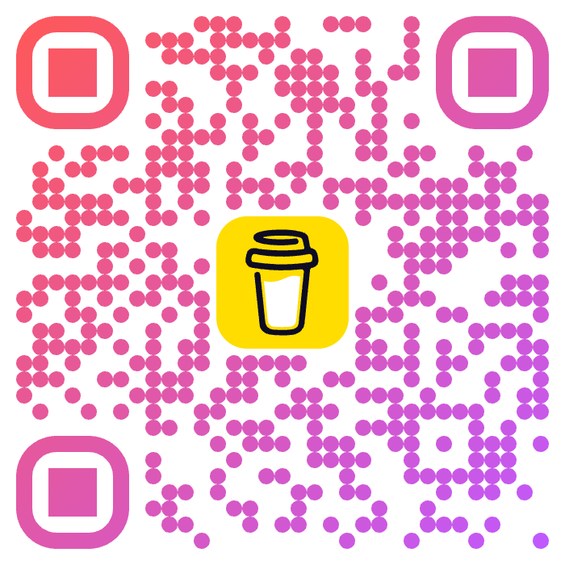

# Support the Project

## Help Us Grow

**x-sign-payload** is an open-source project maintained by the community. Your support helps us:

- 🚀 Add support for more frameworks and languages
- 🐛 Fix bugs and improve security
- 📚 Create better documentation and examples
- 💡 Develop new features based on community needs

## Ways to Support

### ⭐ Star on GitHub

If you find this package useful, please give us a star on GitHub:

**[github.com/wanadri/x-sign-payload](https://github.com/wanadri/x-sign-payload)**

Starring helps others discover the project and shows your appreciation for our work.

### 🐛 Report Issues

Found a bug or have a suggestion? Open an issue on GitHub:

- [Report a Bug](https://github.com/wanadri/x-sign-payload/issues/new?template=bug_report.md)
- [Request a Feature](https://github.com/wanadri/x-sign-payload/issues/new?template=feature_request.md)

### 🤝 Contribute Code

We welcome contributions! Check out our [Contributing Guide](https://github.com/wanadri/x-sign-payload/blob/main/CONTRIBUTING.md) to get started.

Areas where we need help:

- New language/framework support
- Documentation improvements
- Test coverage
- Bug fixes

### ☕ Buy Me a Coffee

If you'd like to support the project financially, scan the QR code below:

  
  
Scan to support the project ☕

Your support keeps the project alive and motivates continued development!

## Thank You!

Whether you star the repo, report an issue, contribute code, or buy a coffee - every bit of support matters. Thank you for being part of the x-sign-payload community! 💚

---

_Made with ❤️ by [Wan Adri](https://github.com/wanadri)_
